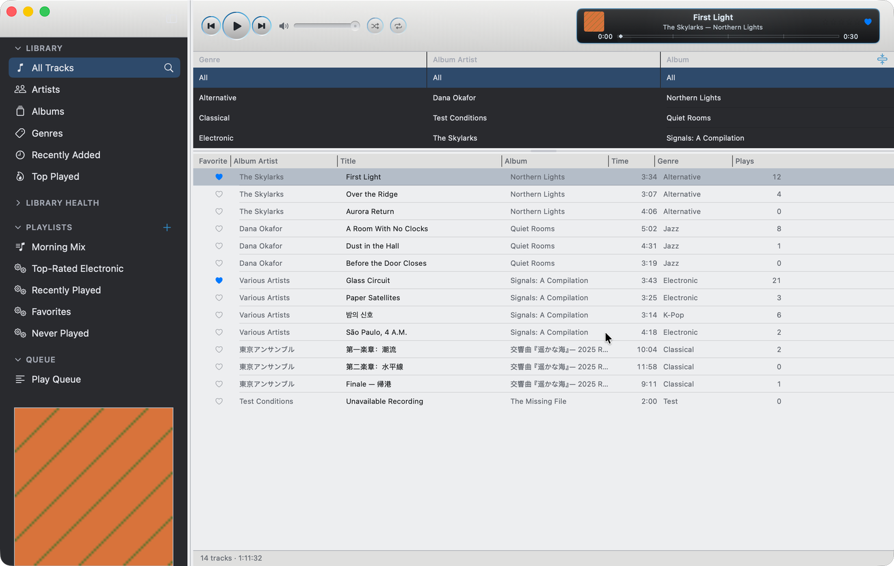
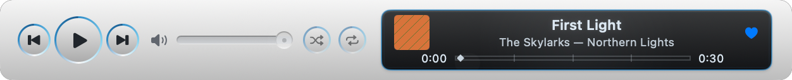
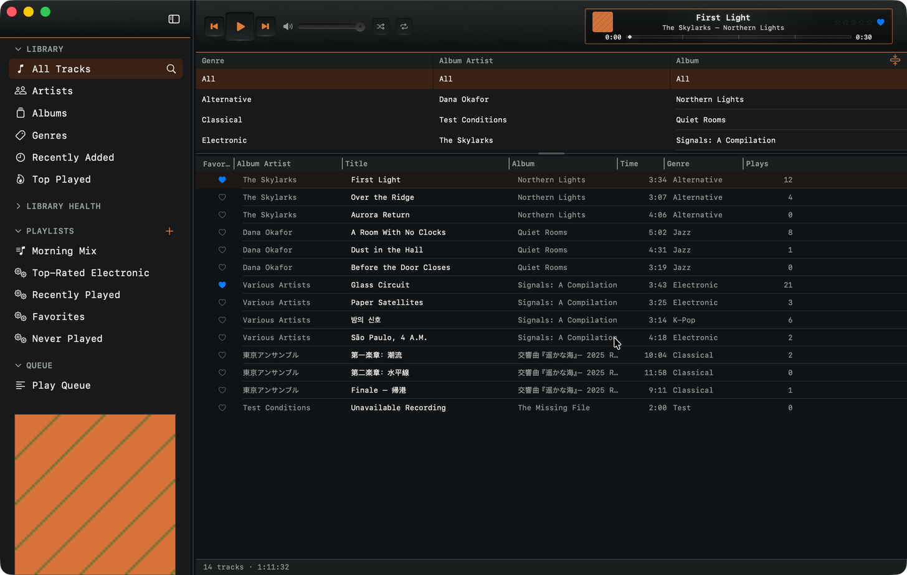
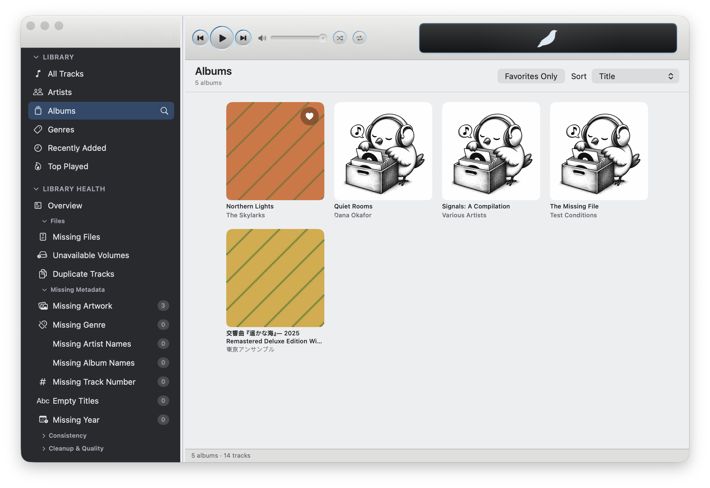

# Songbird

**Version 0.1.0 · Apple Silicon · macOS 14+**

A native macOS music player with a classic, library-first interface. Browse your own music, build playlists, and switch between a full library window and a compact mini player.

Built with SwiftUI, SwiftData, and a native buffered audio engine, inspired by the Songbird/Nightingale interface.

This is a hobby project. Builds are ad-hoc signed and are not notarized by Apple.

## Features

- **Library browsing:** tracks, albums, artists, genres, recently added music, and play counts, with search and cascading filters.
- **Organization:** manual and rule-based smart playlists, favorites, ratings, a play queue, and M3U playlist export.
- **Playback:** native buffered local-file playback, gapless and crossfade controls, and a compact mini player.
- **Feathers:** classic and newer themes, including Blue Monday and Terminal, with theme-specific Dock icon choices.
- **Library Health:** review missing files, unavailable volumes, duplicate tracks, missing artwork, and incomplete metadata.
- **Metadata and artwork:** track-information editing and optional Discogs artwork/genre lookup; optional Last.fm scrobbling.
- **Folder management:** deliberate imports and scans, plus automatic watching for eligible local folders. Network folders use manual scans.

Recognized local-file extensions: `mp3`, `m4a`, `aac`, `flac`, `wav`, `aiff`, and `aif`. Playback of non-FLAC files uses the system audio APIs; a recognized extension does not guarantee every codec/container combination.

## Screenshots

### Library — Blue Monday



### Mini player



<details>
<summary>Terminal theme</summary>



</details>

<details>
<summary>Album browser</summary>



</details>

All screenshots use a fictional demo library.

## Requirements

- **macOS 14 or later.** The current build was tested on macOS 26; macOS 14 has not been tested separately.
- **Apple Silicon** for the bundled dependencies as currently supplied. The aubio library is arm64-only, so this is not an Intel/universal build.
- **Xcode with its command-line tools selected.** Tested with Xcode 26.6 and Apple Swift 6.3.3.
- Bundled dependency sources support offline builds; set `SONGBIRD_OFFLINE_DEPS=1`. Discogs, Last.fm, and online CD metadata are optional network features.

### Last.fm in distributed builds

Last.fm uses a **Sign in with Last.fm** button and browser approval. The maintainer
configures the application's Last.fm API identity once when packaging; listeners
do not need their own API accounts. Existing saved sessions remain supported.

For a configured build, provide `SONGBIRD_LASTFM_API_KEY` and
`SONGBIRD_LASTFM_API_SECRET` in the environment when running `./build.sh`.
Alternatively, keep `SongbirdLastFMAPIKey` and `SongbirdLastFMAPISecret` in a private
plist at `~/.config/songbird/lastfm-build.plist` (or set `SONGBIRD_LASTFM_CONFIG`
to its path). The packager includes them in the signed app. Keep credential values out of Git,
terminal history, and build logs. As with other desktop clients, application
credentials shipped inside the app are extractable. Builds without an application
identity can reuse previously saved credentials but cannot start a fresh sign-in.

## Build and run

From the repository root:

```sh
./build.sh
open ./Songbird.app
```

`build.sh` compiles release products, packages the runtime libraries and resources, and verifies the resulting app's ad-hoc signature. It **replaces the output `Songbird.app` bundle**; do not point it at an installation you need to preserve. Building does not itself launch the app.

For compilation without packaging or launch:

```sh
swift build -c release
```

The scripts and vendored dependencies must be included in your checkout. A local signature check is not Apple notarization. If macOS blocks a downloaded dependency, verify its source before granting a local exception; do not disable Gatekeeper globally.

## Development and testing

```sh
./check.sh quick
./scripts/validate-agent-harness.sh README.md docs/screenshots/README.md
```

`quick` runs the Swift package tests. See [TESTING.md](TESTING.md) for focused checks, audio Thread Sanitizer coverage, and testing with a disposable library.

Useful starting points:

- [Architecture](ARCHITECTURE.md) — subsystem ownership and data flow.
- [Audio engine](AUDIO_ENGINE.md) — native playback and real-time constraints.
- [Documentation index](docs/.INDEX.md) — repository guidance and current work.

## Current limitations

- Physical-CD playback, ripping and eject have been tested. AirPlay and the broader [audio hardware matrix](Tests/HardwareAudioMatrix.md) remain untested.
- **Back up important music and library data before experimenting.** Metadata writeback can modify audio files; do not assume every editing operation is catalog-only.

## Licensing and acknowledgments

Songbird's original application code is licensed under [GPL-3.0-or-later](LICENSE).

Songbird uses **aubio**, **libFLAC**, **libogg**, and **GRDB.swift**. The original Songbird bird design is credited to **Pioneers of the Inevitable**.

Third-party libraries and artwork retain their own terms. See the [third-party notices](THIRD_PARTY_NOTICES.txt) for credits and licenses, and [source and build instructions](SOURCE_CODE.md) for the included dependency sources.

This application uses Discogs’ API but is not affiliated with, sponsored or endorsed by Discogs. ‘Discogs’ is a trademark of Zink Media, LLC.

Saved artwork and metadata remain in your library. Temporary Discogs lookup results may expire.
